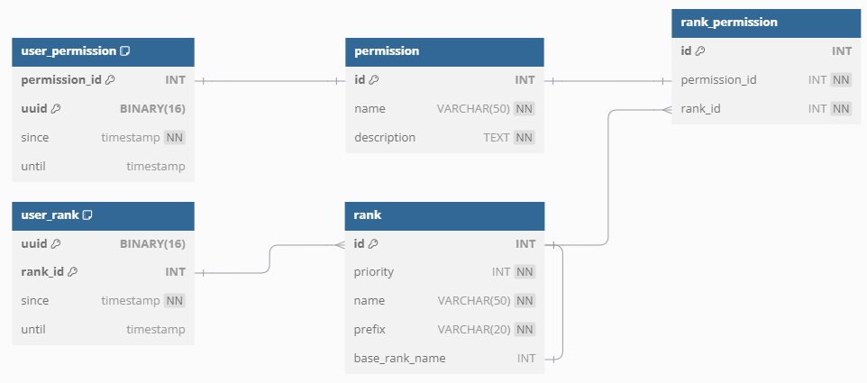

# PermissionSystem

Bewerbungsaufgabe für PlayLegend - PermissionSystem

Java Version: 
21 
Gradle Version: 
8.5 
Gradle JVM Version: 
21 
Minecraft Version:
1.21.1 

### Benutze Dependecies:

- [SADU](https://github.com/rainbowdashlabs/sadu) mit Postgresql!
- [ProtocolLib](https://github.com/dmulloy2/ProtocolLib) (Hier wird ein Snapshot verwendet!)
- [Jackson](https://github.com/FasterXML/jackson-core)
- [Lombok](https://github.com/projectlombok/lombok)
- [Paper-API](https://github.com/PaperMC/Paper)
- [JUnit-5](https://github.com/junit-team/junit5)
- [Mockito](https://github.com/mockito/mockito)

### Gradle Tasks:

##### testPlugin

Startet mit dem gradle Plugin dev.s7a.gradle.minecraft.server einen Minecraft server. 
Lädt hierfür eine ProtocolLib Plugin
von [ProtocolLib Jenkins](https://ci.dmulloy2.net/job/ProtocolLib/732/artifact/build/libs/) herrunter. 
Startet ein PostgreSQL Docker Container aus gehen von der src/test/resources/compose.yaml. 

#### test

Startet ein PostgreSQL Docker Container.
Führt dann alle Test aus.

#### shadowJar

Baut das endgültige Plugin.

### Sprache:

Alles Nachrichten und Texte sind in den Sprach jsons und pluginfolder/languages/ definiert und konfigurierbar.
Für die Serialisierung wird [miniMessage](https://docs.advntr.dev/minimessage/format.html) benutzt.
Wenn ein Spieler joint, wird die Sprache des Clients in dem PDC des Spielers gespeichert.
Mit dem Befehl /language <locale> kann die Sprach geändert werden. Damit ist derzeit nur de_DE (GERMANY) und en_US (US)
unterstützt.
Wenn eine Translation nicht gefunden wird, gilt es als 'unexpected behavior'. In der Regel wird versucht die Translation
in Deutsch zu finden.

### Visuals:

- Sidebar 
  Zeigt denn Prefix des Ranks mit der höchsten Priorität auf der Seiten Tabelle an.
  Titel und Zeile 1 sind in der Sprach jsons Konfigurierbar (sidebar_title & sidebar_row_1).
- Sign 
  Mit dem Kommandon permission sign <register/unregister> können auf einem Schild aktiviert/deaktiviert werden.
  Zeigt Rang und Dauer an. Können in der Sprach jsons konfiguriert werden. (permission_sign_row_<1..4>)
  Für die Umsetzung wird ProtocolLib verwendet!
- TabList 
  Zeigt in der TabList die Spieler mit dem Prefix von ihrem höchsten Rank an. Sortiert nach Priorität des höchsten
  Ranks.

### Permissions:

- \* ALL operator wird unterstützt.
- \- Negative operator wird unterstützt.

### Befehle:

<ul>
<li>
/rank <RankName> add user <SpielerName> [Optional von jetzt plus '1y1M1d1h1m']

Permission: pl.permission.rank.add 
Füge einen Spieler einem Rank hinzu. Optional kann eine Dauer hinzugefügt werden.
</li>
<li>
/rank create <Neuer Rank Name> <Priorität des Rank> <Prefix des Rank (miniMessage)> [Optionaler Base Rank]

Permission: pl.permission.rank.create 
Erstellt einen Neuen Rank. 
Da ein Spieler mehrere Ränge besitzen kann, gibt die Priorität an, welcher in den Visuals angezeigt wird. 
Prefix als miniMessage wird in den Visuals benutzt. 
Optional kann ein Base Rank hinterlegt werden (Alle Rechte des Base Ranks besitzt der neue Rank ebenfalls). 
Priorität von 1000 oder mehr gilt als 'unexpected behavior'.
</li>
<li>
/rank <RankName> remove user <SpielerName>

Permission: pl.permission.rank.remove 
Entfernt dem Spieler denn Rank.
</li>
<li>
/rank <rank> permission add <permission>

Permission: pl.permission.rank.permission.add 
Gibt dem Rank die Permission.
</li>
<li>
/rank <rank> permission remove <permission>

Permission: pl.permission.rank.permission.remove 
Entfernt dem Rank die Permission.
</li>
<li>
/permission <SpielerName> add <permission> [Optional von jetzt plus '1y1M1d1h1m']

Permission: pl.permission.permission.add 
Gibt einem Spieler die Permission. Optional kann hier eine Dauer übergeben werden.
</li>
<li>
/permission <SpielerName> remove <permission>

Permission: pl.permission.permission.remove 
Entfernt einem Spieler die Permission.
</li>
<li>
/permission sign register

Permission: pl.p_sign.add 
Aktiviert: Nächste Sign, mit welchen Interagiert wird, wird zu einem Permission Schild.
</li>
<li>
/permission sign unregister

Permission: pl.p_sign.remove 
Aktiviert: Nächste Permission Sign, mit welchen Interagiert wird, wird zu einem normalen Schild.
</li>
<li>
/language <locale> verändere deine Sprache

Permission: none 
Verändere deine Sprache. Unterstützte Sprachen de_DE und en_US.
</ul>

RankNamen sind case sensitive!
Sollte von einem Rank die Gültigkeit auslaufen, wird diese nicht in den Visuals direkt aktualisiert.

### Die nächsten TODOS:

- implement cache for Rank
- prevent sql injections (in Services).
- Rank information command.
- able to change description for permissions.
- delete rank command. Repository already supports delete cascade.
- junit test for commands.
- make competition async & display ranks in permission command as completion.

### Database struct (POSTGRESQL!):

<!--Tables dbdiagram.io:

Table permission {
id INT [primary key, increment]
name VARCHAR(50) [unique, not null]
description TEXT [NOT NULL]
}

Table rank {
id INT [primary key, increment]
priority INT [unique, not null]
name VARCHAR(50) [not null]
prefix VARCHAR(20) [not null]
base_rank_name INT [ref: - rank.id, null]
}

Table rank_permission {
id INT [primary key, increment]
permission_id INT [ref: - permission.id, not null]
rank_id INT [ref: > rank.id, not null]
}

Table user_permission {
permission_id INT [primary key, ref: - permission.id]
uuid BINARY(16) [primary key]
since timestamp [not null]
until timestamp [null]
}

Table user_rank {
uuid BINARY(16) [primary key]
rank_id INT [primary key, ref: < rank.id]
since timestamp [not null]
until timestamp [null]
}
-->
